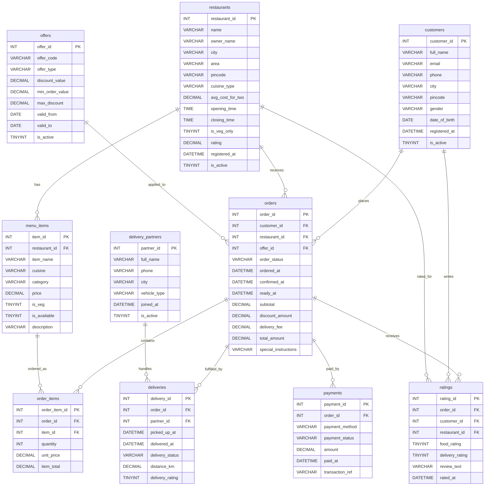

# QuickBite India OLTP ER Diagram

This ER diagram represents the normalized MySQL OLTP source system used in the hackathon.

```mermaid
erDiagram
    customers {
        INT customer_id PK
        VARCHAR full_name
        VARCHAR email
        VARCHAR phone
        VARCHAR city
        VARCHAR pincode
        VARCHAR gender
        DATE date_of_birth
        DATETIME registered_at
        TINYINT is_active
    }

    restaurants {
        INT restaurant_id PK
        VARCHAR name
        VARCHAR owner_name
        VARCHAR city
        VARCHAR area
        VARCHAR pincode
        VARCHAR cuisine_type
        DECIMAL avg_cost_for_two
        TIME opening_time
        TIME closing_time
        TINYINT is_veg_only
        DECIMAL rating
        DATETIME registered_at
        TINYINT is_active
    }

    menu_items {
        INT item_id PK
        INT restaurant_id FK
        VARCHAR item_name
        VARCHAR cuisine
        VARCHAR category
        DECIMAL price
        TINYINT is_veg
        TINYINT is_available
        VARCHAR description
    }

    offers {
        INT offer_id PK
        VARCHAR offer_code
        VARCHAR offer_type
        DECIMAL discount_value
        DECIMAL min_order_value
        DECIMAL max_discount
        DATE valid_from
        DATE valid_to
        TINYINT is_active
    }

    delivery_partners {
        INT partner_id PK
        VARCHAR full_name
        VARCHAR phone
        VARCHAR city
        VARCHAR vehicle_type
        DATETIME joined_at
        TINYINT is_active
    }

    orders {
        INT order_id PK
        INT customer_id FK
        INT restaurant_id FK
        INT offer_id FK
        VARCHAR order_status
        DATETIME ordered_at
        DATETIME confirmed_at
        DATETIME ready_at
        DECIMAL subtotal
        DECIMAL discount_amount
        DECIMAL delivery_fee
        DECIMAL total_amount
        VARCHAR special_instructions
    }

    order_items {
        INT order_item_id PK
        INT order_id FK
        INT item_id FK
        INT quantity
        DECIMAL unit_price
        DECIMAL item_total
    }

    payments {
        INT payment_id PK
        INT order_id FK
        VARCHAR payment_method
        VARCHAR payment_status
        DECIMAL amount
        DATETIME paid_at
        VARCHAR transaction_ref
    }

    deliveries {
        INT delivery_id PK
        INT order_id FK
        INT partner_id FK
        DATETIME picked_up_at
        DATETIME delivered_at
        VARCHAR delivery_status
        DECIMAL distance_km
        TINYINT delivery_rating
    }

    ratings {
        INT rating_id PK
        INT order_id FK
        INT customer_id FK
        INT restaurant_id FK
        TINYINT food_rating
        TINYINT delivery_rating
        VARCHAR review_text
        DATETIME rated_at
    }

    customers ||--o{ orders : places
    restaurants ||--o{ orders : receives
    offers ||--o{ orders : applied_to
    restaurants ||--o{ menu_items : has
    orders ||--o{ order_items : contains
    menu_items ||--o{ order_items : ordered_as
    orders ||--o{ payments : paid_by
    orders ||--o{ deliveries : fulfilled_by
    delivery_partners ||--o{ deliveries : handles
    orders ||--o{ ratings : receives
    customers ||--o{ ratings : writes
    restaurants ||--o{ ratings : rated_for
```

